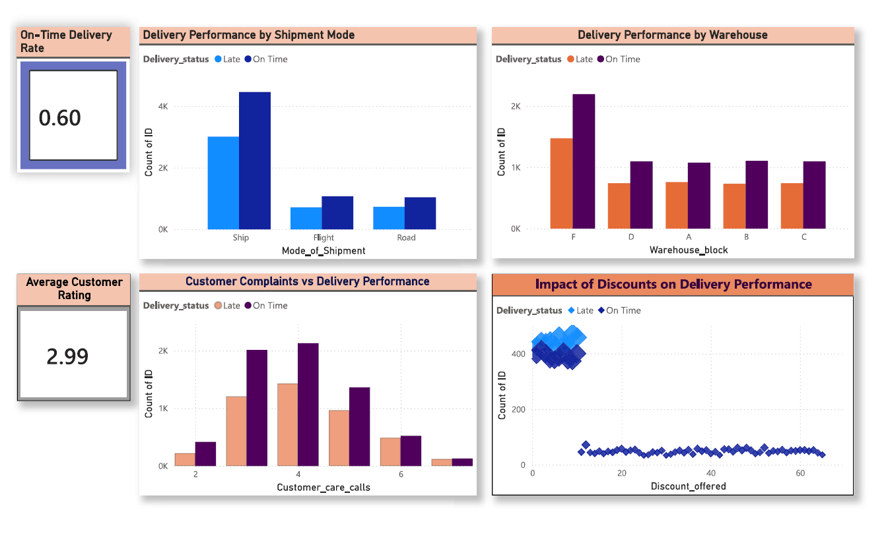

# 📦 Supply Chain & Inventory Optimization System

## 🧠 Project Overview

Designed and developed an end-to-end **Supply Chain Analytics System** to identify inefficiencies in delivery operations, warehouse performance, and customer experience.

This project leverages **data-driven decision making** to optimize logistics, reduce delays, and improve overall operational efficiency.

The solution integrates:

* 🐍 Python for data preprocessing & EDA
* 🧮 SQL for advanced analytics and business logic
* 📊 Power BI for interactive dashboards and KPI tracking

---

## 🛠 Tools & Technologies

* **Python (Pandas, NumPy)** – Data cleaning, preprocessing & EDA
* **MySQL** – Advanced querying (CTEs, Window Functions, Subqueries)
* **Power BI** – KPI dashboards & business visualization

---

## 📊 Dashboard Preview



---

## 🎯 Business Problems Solved

* 🚚 Identify root causes of delivery delays
* 🏭 Evaluate warehouse performance inefficiencies
* 📞 Analyze customer complaints and service quality
* 💰 Measure impact of discount strategies on logistics
* 📦 Optimize inventory and reduce stockout risks

---

## 📁 Project Structure

```
supply-chain-analytics-dashboard/
│
├── data/
├── notebooks/
│   └── supply_chain_analysis.ipynb
│
├── sql/
│   └── queries.sql
│
├── dashboard/
│   └── dashboard.png
│
├── README.md
```

---

## 🐍 Data Processing (Python)

* Cleaned and transformed raw dataset using Pandas
* Handled missing values and inconsistent formats
* Performed exploratory data analysis (EDA)
* Prepared structured dataset for SQL and Power BI

📌 Notebook: `notebooks/supply_chain_analysis.ipynb`

---

## 🧮 SQL Analysis

### Key Concepts Used:

* Window Functions (`RANK()`, `LAG()`, `LEAD()`, `SUM() OVER`)
* Common Table Expressions (CTEs)
* Subqueries & Nested Aggregations
* Date-time functions for delay tracking

### Key Queries Implemented:

1. Supplier on-time delivery performance analysis
2. Identification of slow-moving products
3. Inventory turnover ratio calculation
4. Stock-out risk prediction
5. Rolling sales trend analysis
6. Customer segmentation based on behavior
7. Dynamic restocking recommendation system

📌 SQL File: `sql/queries.sql`

---

## 📈 Key KPIs

* 📊 On-Time Delivery Rate (~60%)
* ⭐ Average Customer Rating (~3.0)
* 📞 Average Customer Care Calls

---

## 📊 Key Insights

### 🚚 Shipment Analysis

* Air/Flight shipments exhibit higher delay rates compared to road transport

### 🏭 Warehouse Performance

* Certain warehouses consistently underperform, indicating operational bottlenecks

### 📞 Customer Behavior

* Increased customer care calls strongly correlate with delayed deliveries

### 💰 Discount Impact

* High discount campaigns are associated with increased delivery delays, indicating operational strain

---

## 💡 Business Recommendations

* Optimize logistics handling for high-discount orders
* Improve efficiency in underperforming warehouses
* Reduce dependency on slower shipment modes
* Strengthen proactive customer support for high-risk deliveries

---

## 🚀 Conclusion

This project demonstrates the ability to build a complete **data analytics pipeline** and translate raw data into actionable business insights.

It highlights strong capabilities in:

* Data processing
* SQL-based analytics
* Dashboard storytelling
* Business decision support
